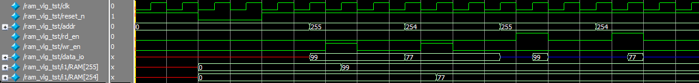

> author : zyl <br/>
> date   : 2018-8-11 <br/>
> addr   : whu.edu.ionophereLad <br/>
> ref    : [addr1][1] [addr2][2] [addr3][3] [addr4][4]


# 目录
- [接口](#接口)


- [1 流水线](#1-流水线)
   - [1.1 概念](#1.1-概念)
   - [1.2 流水线的使用](#1.2-流水线的使用)
   - [1.3 优缺点](#1.3-优缺点)
   - [1.4 例子](#1.4-例子)
   - [1.5 总结](#1.5-总结)
- [2 存储器](#2-存储器)
   - [2.1 目的](#2.1-目的)
   - [2.2 步骤](#2.2-步骤)
   - [2.3 RAM 模块设计](#2.3-RAM-模块设计)
   - [2.4 仿真及验证](#2.4-仿真及验证)
   - [2.5 结果](#2.5-结果)
   - [2.6 注意事项](#2.6-注意事项)
- [3 密码锁](#3-密码锁)
   - [3.1 目的](#3.1-目的)
   - [3.2 端口设计](#3.2-端口设计)
   - [3.3 功能介绍](#3.3-功能介绍)
   - [3.4 输入判定](#3.4-输入判定)
   - [3.5 状态机设计](#3.5-状态机设计)

- [串口]()
---
# 1 流水线
## 1.1 概念
> 流水线，最早为人熟知，起源于十九世纪初的福特汽车工厂，富有远见的福特，改变了那种人围着汽车转、负责各个环节的生产模式，转变成了流动汽车组装线和固定操作的人员。于是，工厂的一头是不断输入的橡胶和钢铁，工厂的另一头则是一辆辆正在下线的汽车。这种改变，不但提升了效率，更是拉开了工业时代大生产的序幕。这种模式常常应用于数字电路的设计之中，与现在流驱动的 FPGA 架构不谋而合。


概念：流水线设计就是将组合逻辑系统地分割，并在各个部分/分级之间插入寄存器，并暂存中间数据的方法。目的是将一个大操作分解成若干的小操作，每一步小操作的时间较小，所以能提高频率，各小操作能并行执行，所以能提高数据吞吐率，提高处理速度。

## 1.2 流水线的使用
一般的定义是如果某个设计的处理流程可分为若干步骤，而且整个数据处理是**单流向**，即没有反馈或者迭代运算，且前一个步骤的输出是下一个步骤的输入，则可以考虑采用流水线设计方法来提高系统频率。从这里我们可以看出，流水线就是将我们的以前的大逻辑块分解为小逻辑块，以此来降低寄存器间的传播时延，从而保证系统维持在一个高的系统时钟速度。
使用流水线一般是时序比较紧张，对电路工作频率较高的时候。典型情况如下：
1. 功能模块之间的流水线，用乒乓 buffer 来交互数据。代价是增加了 memory 的数量，但是和获得的巨大性能提升相比，可以忽略不计
2. I/O 瓶颈，比如某个运算需要输入 8 个数据，而 memroy 只能同时提供 2 个数据，如果通过适当划分运算步骤，使用流水线反而会减少面积
3. 片内 sram 的读操作，因为 sram 的读操作本身就是两极流水线，除非下一步操作依赖读结果，否则使用流水线是自然而然的事情
4. 组合逻辑太长，比如(a+b)*c，那么在加法和乘法之间插入寄存器是比较稳妥的做法


## 1.3 优缺点

1. 优点： 流水线缩短了在一个时钟周期内给的那个信号必须通过的通路长度，增加了数据吞吐量，从而可以提高时钟频率，但也导致了数据的延时。例如：一个 2 级组合逻辑，假定每级延迟相同为 T
   1. 无流水线的总延迟就是 2T，可以在一个时钟周期完成，但是时钟周期受限制在 2T
   2. 流水线：每一级加入寄存器(延迟为t)后，单级的延迟为 T+t，每级消耗一个时钟周期，流水线需要 2 个时钟周期来获得第一个计算结果，称为首次延迟，它要2*(T+t)，但是执行重复操作时，只要一个时钟周期来获得最后的计算结果，称为吞吐延迟(T+t)。可见只要 t 小于 T，流水线就可以提高速度。 特别需要说明的是，流水线并不减小单次操作的时间，减小的是整个数据的操作时间，请大家认真体会

2. 缺点：功耗增加，面积增加，硬件复杂度增加，特别对于复杂逻辑如 cpu 的流水线而言，流水越深，发生需要 hold 流水线或 reset 流水线的情况时，时间损失越大。 所以使用流水线并非有利无害，大家需权衡考虑。在设计中引入流水线延时，插入一级寄存器带来的流水线延时是一个时钟周期。

## 1.4 例子
以`8位加法器`说明流水线和非流水线的区别

``` verilog
/*
 * file   : adder1.v ; adder2.v
 * author : zyl
 * date   : 2018-8-11
 * addr   : whu.edu.ionosphereLab
 */

/*************************** 普通8位加法器 ************************/

module adder1(

input       [7:0]      A,
input       [7:0]      B,
output reg  [8:0]      sum,

assign SUM[8:0] = {1'd0, A} + {1'd0, B};

endmodule
//end adder1

/************************** 8位流水线加法器 ***********************/

module adder2(
input                  clk,
input                  cin,
input       [7:0]      A,
input       [7:0]      B,

output reg  [7:0]      sum,
output reg             cout
);


reg            cout1;
reg   [3:0]    sum1;
reg   [3:0]    A_reg;
reg   [3:0]    B_reg;


//第一级流水
always @(posedge clk) begin
    {cout1 ,sum1} <= A[3:0] + B [3:0] + cin;
    A_reg <= A[7:4];
    B_reg <= B[7:4];
end


//第二级流水
always @(posedge clk) begin
    {cout ,sum} <= {{1'b0, A_reg} + {1'b0, B_reg} + cout1, sum1};
end

endmodule
//end adder2
```

采用两级流水线：第一级低 4 位，第二级高 4 位，所以第一个输出需要 2 个时钟周期有效，后面的数据都是 1 个周期
之后有效。

## 1.5 总结
这里讲到的流水线，主要是一种硬件设计的算法，如第一条中表述的流水线设计就是将组合逻辑系统地分割，并在各
个部分（分级）之间插入寄存器，并暂存中间数据的方法。针对处理器中的流水线结构。比如，比如几个不同功能的电路单元组成一条指令处理流水线，然后将一条指令分成几步后再由这些电路单元分别执行，这样就能实现在一个 CPU 时钟周期完成一条指令，因此提高 CPU 的运算速度。 一般的 CPU 中,每条整数流水线都分为四级流水， 即指令预取、 译码、 执行、 写回结果，OpenRISC 采用的是 5 级整数流水线。它们的核心思想都是利用并行执行提高效率。`简单来说，流水线就是插入寄存器，以面积换取速度。`

---

# 2 存储器

## 2.1 目的
实现 RAM 的构造读写数据，并仿真验证模块的功能

## 2.2 步骤
1. 模拟一个位宽为 32 位，深度为 256 的 RAM
2. 使用 HDL 编写 ram 模块以及 test bench 仿真测试代码
3. 检验数据是否可读可写是否正确
4. 时序分析

## 2.3 RAM 模块设计
```
端口：
   clk      时钟信号
   reset_n  复位信号，低电平有效
   write_en 写使能，高电平有效
   read_en  读使能，高电平有效
   address  地址线, 8位
   dataIO   数据线，32位

要求：
   当 write_en 有效时，表示为写入到内存的数据；当 read_en 有效时，表示读出内存数据；两者需要在不同时刻读写

+----------------+
|                |-----<  clk
|                |
|                |-----<  reset_n
|                |
|                |-----<  write_en
|                |
|                |-----<  read_en
|      RAM       |
|                |-----<  address [ 7:0]
|    32 x 256    |
|                |-----<> dataIO  [31:0]
+----------------+
```
[点击查看 RMA 模块代码](code/ram.v)


## 2.4 仿真及验证
使用 `quartue` 生成 test bench 测试文件，然后打开 modelsim 将其添加到工程中，全部编译，然后选择文件进行仿真。在 test bench 中，添加3个任务块，分别是初始化任务块、写任务块和读任务块。在初始化任务块中，将 clk，reset_n 等端口设定初始值；在写任务块中，设定地址和数据输入端口，然后在写 RMA 时，要先传入地址和数据，然后再打开写使能；在读任务块中，只需要设定地址端口，但是在打开读使能端口前，要把数据端的状态设为高阻态，这样才能使得数据能够传入数据端。

使用双向口的话需要利用三态门进行输入输出的控制。使用条件操作符实现三态门的构造。在时钟上升沿，若写信号有效，则将当前地址线对应存储器的空间存入当前 dataIO 上的数据；若读信号有效，则将地址线对应存储器空间的数据输出至 dataIO，读写无效时为高阻态。

[点击查看 test bench 代码](code/testBench.v)


## 2.5 结果


如图所示，在该仿真中，我测试2次写入操作，分别在 [test bench](code/testBench.v) 中的 **write(255 ,99);** 和 **write(254, 77);** 写入之后，又分别从 RAM 中读取了地址为 255 和 254 的数据。在 data_io 端口可以观察到，当在 wr_en 写使能打开之前， addr 地址端和 data_io 数据端就已经传入数据了，在写使能打开时的时钟上升沿，data_io 的数据传入到了 RAM 中，这时 RAM 中地位为 255 和 254 的内存数据已经发生改变。同样，在 rd_en 读使能打开前，地址端已改变，而且 data_io 数据端成高阻态，等待接受数据，在读使能打开时的时钟上升沿， RAM 中的数据传出到 data_io 端口。读使能接受，而写使能也为打开，此时的数据端口呈现高阻态。以上结果能够验证，RAM 模块正常工作，需要注意的是，在读写时，读使能/写使能需要持续至少1个时钟周期，而且需要在时钟上升沿到来之前，使能端口就已经打开，这样才能保证在相应的时间内写入或者读出数据。

## 2.6 注意事项
1. 因为地址空间较大，最好用 task 来实现 testbench 的编写，可使仿真清晰明了。
2. 读写均无效时输出为高阻态，应该使用三态门。
3. 代码中注释，工程目录不能含有中文。
4. 使用 `modelsim` 仿真时应选择最顶层的文件进行仿真。
5. inout 接口使用三态门结构实现，当不向外输出时置为高阻态，此时 inout 的值由外界输入决定。需要输出时连接内部输出缓存，以实现 inout 功能。

---

# 3 密码锁
## 3.1 目的
实现一个6位数字密码锁

特征如下：
- [x] 支持修改密码
- [x] 支持接口扩展
- [x] 支持休眠
- [x] 支持返回

不足之处：
- [ ] 无按键消抖
- [ ] 无法退格
- [ ] 密码位数固定
- [ ] 不支持组合键

## 3.2 端口设计
### 密码锁端口：
```
输入端：
    clk                 时钟
    reset_n             复位，低电平有效
    inputChar           输入按键 [0 1 2 3 4 5 6 7 8 9 * #]，12位，对应下方 4x3 矩阵键盘
    password            外部密码输入，防止内部密码寄存器掉电丢失，6位

输出端:
    open                开门信号，高电平有效或者上升沿有效

+----------------+
|                |-----<  clk
|                |
|                |-----<  reset_n
|                |
|                |-----<  inputChar [11:0]
|      lock      |
|                |-----<  password  [ 5:0]
|                |
|                |----->  open
+----------------+
```
### 4x3 矩阵键盘：
```
+---+---+---+
| 7 | 8 | 9 |
+---+---+---+
| 4 | 5 | 6 |
+---+---+---+
| 1 | 2 | 3 |
+---+---+---+
| * | 0 | # |
+---+---+---+
```
### 相关定义：
1. 输入密码只能是[0-9]的数字
2. [*]号键输入表示重设密码
3. [#]号键输入表示返回初始状态

## 3.3 功能介绍
使用者输入6位数密码，当密码输入全部正确，则开门；否则回到初始状态，等待重新输入。在任何情况下输入[#]号键可以返回初始状态，比如在密码输入错误的情况下。在初始状态下，输入[*]号键进入重置密码模式，要求首先输入原密码，如果输入错误导致无法验证密码，则回到初始状态，在输入正确的情况下继续输入6位数的新密码，至此，密码修改完成。

## 3.4 输入判定
输入端口 inputChar 连接 4x3 矩阵键盘的12个输入信号线，每当时钟的上升沿来到时，判定哪个按键按下。由于只对单个信号线的输入做了 case 判断，因此该密码锁不支持组合键，当然，如果需要，可以对其进行扩展。在任意按键按下时，将 pressing 寄存器置 1 ，目的是锁键，因为在任意时刻在按键按下之后要等待该按键释放才能输入第二个数，否则在持续按键时会一直输入，这不能达到精确输入的目的。在密码锁中，大概有2种对输入进行反馈的方式，（1）在按键按下后，对按键做出相应的处理，然后等待该按键释放；（2）在按键按下后，记录下当前按键的信息，等待该该按键释放后做出相应的处理。我选择第一种方式，以下时序逻辑块就是对输入进行判定：


```verilog
reg                    pressing      = 0; // 输入状态，1为正在输入
reg        [7:0]       curInputChar  = 0; // 当前输入字符


always @(posedge clk) begin
    case (inputChar)
      12'b000000000001:begin
        curInputChar <= 0;
        pressing     <= 1;
      end
      12'b000000000010:begin
        curInputChar <= 1;
        pressing     <= 1;
      end
      12'b000000000100:begin
        curInputChar <= 2;
        pressing     <= 1;
      end
      12'b000000001000:begin
        curInputChar <= 3;
        pressing     <= 1;
      end
      12'b000000010000:begin
        curInputChar <= 4;
        pressing     <= 1;
      end
      12'b000000100000:begin
        curInputChar <= 5;
        pressing     <= 1;
      end
      12'b000001000000:begin
        curInputChar <= 6;
        pressing     <= 1;
      end
      12'b000010000000:begin
        curInputChar <= 7;
        pressing     <= 1;
      end
      12'b000100000000:begin
        curInputChar <= 8;
        pressing     <= 1;
      end
      12'b001000000000:begin
        curInputChar <= 9;
        pressing     <= 1;
      end
      12'b010000000000:begin
        curInputChar <= 10;
        pressing     <= 1;
      end
      12'b100000000000:begin
        curInputChar <= 11;
        pressing     <= 1;
      end
      default:begin
        curInputChar <= 0;
        pressing     <= 0;
      end
    endcase
end

```

## 3.5 状态机设计
```
                                  +---------------------------->----+
                                  |                                 |
                                  |       +-------------------->----+
                                  |       |                         |
                                  |       |       +------------>----+
                                  |       |       |                 |
                                  |       |       |                 |
 (0)---->(1)---->(2)---->(3)---->(4)---->(5)---->(6)     (7)--->--(255)
  |                       |                               |         |
  |                       |                               |         |
  |                       +------------------>------------+         |
  |                       |                                         |
  |                       +------------------>----------------------+
  |                                                                 |
  +------------------------------------------<----------------------+

各个状态说明：
    (0):初始状态
    (1):接受输入
    (2):输入等待
    (3):决策阶段
    (4):记录输入
    (5):验码阶段
    (6):输出阶段
    (7):输入新密码
    (255):等待按键释放
```
[点击查看完整代码](code/lockeddoor.v)

密码锁的核心是该状态机，目前我只用了一段式状态机去设计整个过程，但是如果要更完整、更可靠地设计状态机，我们应该使用三段式的状态机去描述开锁过程。在该状态机内，我使用了9个状态，如上所示。(0)阶段初始化相应寄存器；(1)阶段开始接受输入信号；(2)阶段等待按键输入，当有按键按下时，跳到(3)阶段；(3)阶段选择当前模式，当第一个输入的是[0-9]数字时，则为登录模式，当输入为[*]时，则为修改模式，当模式确定后，同样在(3)阶段选择下个状态，如果为登录模式，则跳到(4)阶段，如果是修改模式，则跳到(7)模式，如果输入为[#]，则跳到(255)阶段；(4)阶段连续接受输入，当输入达到密码位数时，跳到(5)阶段进行验证，如果验证正确且为登录模式时，则开门，如果验证正确且为修改模式，则进入更新模式；(7)阶段就是输入新密码；(255)阶段等待按键释放。

## 改进

# end


[1]: https://blog.csdn.net/times_poem/article/details/52033535
[2]: https://blog.csdn.net/lizf477/article/details/37730295
[3]: https://blog.csdn.net/stynis/article/details/80555825
[4]: https://blog.csdn.net/w40306030072/article/details/20898795
