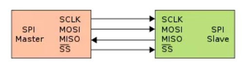
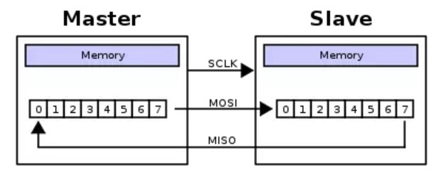

> author : zyl  
> date   : 2018-8-11  
> addr   : whu.edu.ionophereLad  
> ref    : [addr1][1] [addr2][2] [addr3][3] [addr4][4]

# 流水线

## 概念

流水线，最早为人熟知，起源于十九世纪初的福特汽车工厂，富有远见的福特，改变了那种人围着汽车转、负责各个环节的生产模式，转变成了流动汽车组装线和固定操作的人员。于是，工厂的一头是不断输入的橡胶和钢铁，工厂的另一头则是一辆辆正在下线的汽车。这种改变，不但提升了效率，更是拉开了工业时代大生产的序幕。这种模式常常应用于数字电路的设计之中，与现在流驱动的
FPGA 架构不谋而合。

流水线设计就是将组合逻辑系统地分割，并在各个部分/分级之间插入寄存器，并暂存中间数据的方法。目的是将一个大操作分解成若干的小操作，每一步小操作的时间较小，所以能提高频率，各小操作能并行执行，所以能提高数据吞吐率，提高处理速度。

## 原理

流水线的基本原理是把一个重复的过程分解为若干个子过程，前一个子过程为下一个子过程创造执行条件，每一个过程可以与其它子过程同时进行。流水处理过程同工厂中的流水装配线类似。为了实现流水，首先必须把输入的任务分割为一系列的子任务，使各子任务能在流水线的各个阶段并发地执行。将任务连续不断地输入流水线，从而实现了子任务的并行。因此流水处理大幅度地改善了系统性能。

一般的定义是如果某个设计的处理流程可分为若干步骤，而且整个数据处理是**单流向**，即没有反馈或者迭代运算，且前一个步骤的输出是下一个步骤的输入，则可以考虑采用流水线设计方法来提高系统频率。流水线设计的结构示意图如上图所示。其基本结构为：将适当划分的
n个操作步骤单流向串联起来。使用流水线一般是时序比较紧张，对电路工作频率较高的时候。典型情况如下：

1.  功能模块之间的流水线，用乒乓 buffer 来交互数据。代价是增加了 memory
    的数量，但是和获得的巨大性能提升相比，可以忽略不计

2.  I/O 瓶颈，比如某个运算需要输入 8 个数据，而 memroy 只能同时提供 2
    个数据，如果通过适当划分运算步骤，使用流水线反而会减少面积

3.  片内 sram 的读操作，因为 sram
    的读操作本身就是两极流水线，除非下一步操作依赖读结果，否则使用流水线是自然而然的事情

4.  组合逻辑太长，比如(a+b)*c，那么在加法和乘法之间插入寄存器是比较稳妥的做法

## 性质

流水线缩短了在一个时钟周期内给的那个信号必须通过的通路长度，增加了数据吞吐量，从而可以提高时钟频率，但也导致了数据的延时。例如：一个
2 级组合逻辑，假定每级延迟相同为 T

1.  无流水线的总延迟就是 2T，可以在一个时钟周期完成，但是时钟周期受限制在 2T

2.  流水线：每一级加入寄存器(延迟为t)后，单级的延迟为
    T+t，每级消耗一个时钟周期，流水线需要 2
    个时钟周期来获得第一个计算结果，称为首次延迟，它要2*(T+t)，但是执行重复操作时，只要一个时钟周期来获得最后的计算结果，称为吞吐延迟(T+t)。可见只要
    t 小于 T，流水线就可以提高速度。
    特别需要说明的是，流水线并不减小单次操作的时间，减小的是整个数据的操作时间，请大家认真体会

但是使用流水线会使得功耗增加，面积增加，硬件复杂度增加，特别对于复杂逻辑如 cpu
的流水线而言，流水越深，发生需要 hold 流水线或 reset
流水线的情况时，时间损失越大。
所以使用流水线并非有利无害，大家需权衡考虑。在设计中引入流水线延时，插入一级寄存器带来的流水线延时是一个时钟周期。

## 设计

流水线设计的一个关键在于整个设计时序的合理安排，要求每个操作步骤的划分合理。如果前级操作时间恰好等于后级的操作时间，设计最为简单，前级的输出直接汇入后级的输入即可；如果前级操作时间大于后级的操作时间，则需要对前级的输出数据适当缓存才能汇入到后级输入端；如果前级操作时间恰好小于后级的操作时间，则必须通过复制逻辑，将数据流分流，或者在前级对数据采用存储、后处理方式，否则会造成后级数据溢出。

**举例来说明流水线的作用：**设计一个电路完成A+B+C+D+E+F+G+H运算

下面是没有流水线的设计：

第一级的 DFF 在对输入数据进行采样，并经过一段时间（Tco，clock to outputdelay）后输出为 FF1_out，输出数据经过中间的组合逻辑变为 FF2_in 输入到第二级DFF,如果每级组合逻辑的延时为Tcomb。那么可以计算出该电路从第一级 DFF 到第二级 DFF 之间数据路径的时延为Tco+3Tcomb。

下面是流水线设计：

同理，在不同级组合逻辑之间插入寄存器，使其变为流水线设计。那么该电路从第一级 DFF 到第二级 DFF 之间数据路径的时延为Tco+Tcomb。显然，采用流水线的设计，组合逻辑电路的延时更小，系统能够达到的工作时钟频率也就更高。

## 总结

这里讲到的流水线，主要是一种硬件设计的方法，如第一条中表述的流水线设计就是将组合逻辑系统地分割，并在各
个部分（分级）之间插入寄存器，并暂存中间数据的方法。针对处理器中的流水线结构。比如，比如几个不同功能的电路单元组成一条指令处理流水线，然后将一条指令分成几步后再由这些电路单元分别执行，这样就能实现在一个
CPU 时钟周期完成一条指令，因此提高 CPU 的运算速度。一般的 CPU 中,每条整数流水线都分为四级流水， 即指令预取、 译码、 执行、 写回结果，OpenRISC 采用的是 5 级整数流水线。它们的核心思想都是利用并行执行提高效率。简单来说，流水线就是插入寄存器，以面积换取速度。综上，可以看到，虽然流水可以提高系统的工作频率和吞吐率，但是它付出的代价是面积和功耗的增加，这也是**速度和面积之间相互转化**的体现。

# SPI接口

## 概念
SPI是Serial Peripheral Interface
Bus的缩写，是一种高速的，全双工，同步的通信总线。它是一种用于短距通信的同步串行通信接口标准，主要用于嵌入式系统。这个接口是Motorola在1980年末开发的，之后变成一种约定俗成的通信标准。SPI协议使用单个Master的主-从（Master-Slave）结构，以全双工的方式工作。主设备控制读写，多个从设备通过片选信号（SS）连接。

## 原理

采用SPI协议通信的设备通常只需要四条线就可以完成数据的传输，因此，这种占用端口资源少的优点也被称为SPI协议的一个亮点。

1.  SCLK：串行时钟，由Master输出，从机接受SCLK信号。它控制着数据传输的节拍，进而影响数据交换的快慢。

2.  MOSI：（Master output Slave
    input）从字面意思就可以知道，这条线为主出从入，也就是主机的数据输出端口，从机的数据输入端口。（实际上，个人认为将MOSI拆为MO和SI理解更好）

3.  MISO：（Master input Slave output）主入从出，即主机输入，从机输出。

4.  SS：（Slave Select）片选信号。只有该Slave上的SS信号有效时，该Slave才被选中。

SPI通信过程本质上来讲，就是数据的交换。在数据交换的过程中完成数据的发送和接收。主机控制SS信号和SCLK信号的产生，在SS信号有效时，相应的从机被选中。在SCLK的节拍下完成数据的交换。

SPI因为SCLK的不同形式可以分为四种工作模式，四种工作模式受控于CPOL和CPHA。也就是串行时钟SCLK的极性和相位。

| **PI模式** | **时钟极性（CPOL）** | **时钟相位（CPHA）** |
|------------|----------------------|----------------------|
| 0          | 0                    | 0                    |
| 1          | 0                    | 1                    |
| 2          | 1                    | 0                    |
| 3          | 1                    | 1                    |

为了讨论方便，给出一种模式来说明SPI如何工作，以下就是SPI协议完成数据交换的时序图。

在SS有效的情况下，主机在SCLK的前沿通过MOSI输出数据（write），而在SCLK的后沿通过MISO采样数据（read）。对于从机而言，同理，SCLK的前沿通过MISO进行数据输出。SCLK的后沿通过MOSI完成数据的采样。

这样一来，一个SCLK时钟周期可以完成1bit的数据输出和1bit的数据读入，高效的利用了时钟资源。

实际上，根据时序图即可完成Verilog代码的编写，经过一番折腾，完成了master的数据发送。同时，通过test
bench的测试，完成SPI协议的模拟。部分代码给出了一定的说明。

## 设计

下面给出用Verilog HDL语言实现SPI接口的关键程序，相关变量的说明在注释中有介绍：[spiMaster.v](code/spiMaster.v)

其配套的testbench代码在 [TestBench_spiMaster.v](code/TestBench_spiMaster.v)

# 存储器

## 概念

存储器（Memory）是现代信息技术中用于保存信息的记忆设备。其概念很广，有很多层次，在数字系统中，只要能保存二进制数据的都可以是存储器；在集成电路中，一个没有实物形式的具有存储功能的电路也叫存储器，如RAM、FIFO等；在系统中，具有实物形式的存储设备也叫存储器，如内存条、TF卡等。计算机中全部信息，包括输入的原始数据、计算机程序、中间运行结果和最终运行结果都保存在存储器中。它根据控制器指定的位置存入和取出信息。有了存储器，计算机才有记忆功能，才能保证正常工作。计算机中的存储器按用途存储器可分为主存储器（内存）和辅助存储器（外存）,也有分为外部存储器和内部存储器的分类方法。外存通常是磁性介质或光盘等，能长期保存信息。内存指主板上的存储部件，用来存放当前正在执行的数据和程序，但仅用于暂时存放程序和数据，关闭电源或断电，数据会丢失。

## 存储器分类

按存储介质

-   半导体存储器：用半导体器件组成的存储器。

-   磁表面存储器：用磁性材料做成的存储器。

按存储方式

-   随机存储器：任何存储单元的内容都能被随机存取，且存取时间和存储单元的物理位置无关。

-   顺序存储器：只能按某种顺序来存取，存取时间和存储单元的物理位置有关。

按读写功能

-   只读存储器(ROM)：存储的内容是固定不变的，只能读出而不能写入的半导体存储器。

-   随机读写存储器(RAM)：既能读出又能写入的半导体存储器。

按信息保存性

-   非永久记忆的存储器：断电后信息即消失的存储器。

-   永久记忆性存储器：断电后仍能保存信息的存储器。

按用途

-   根据存储器在计算机系统中所起的作用，可分为主存储器、辅助存储器、高速缓冲存储器、控制存储器等。

-   为了解决对存储器要求容量大，速度快，成本低三者之间的矛盾，通常采用多级存储器体系结构，即使用高速缓冲存储器、主存储器和外存储器。

## 工作原理

这里节介绍存储器的工作原来，存储器种类繁多，每种存储器的工作方式都有很大差异，但是目的都是为了存储二进制数据，下面就静态/动态随机存储器的工作原来做介绍。

随机存取存储器RAM是Random Access
Memory的缩写，又称作“随机存储器”，是与CPU直接交换数据的内部存储器，也叫内存。它可以随时读写，而且速度很快，通常作为操作系统或其他正在运行中的程序的临时数据存储媒介。之所以称其为随机存储器，是因为存储单元的内容可按需随意取出或存入，且存取的速度与存储单元的位置无关的存储器。这种存储器在断电时将丢失其存储内容，故主要用于存储短时间使用的程序。按照存储单元的工作原理，随机存储器又分为静态随机存储器SRAM和动态随机存储器DRAM。

动态随机存取存储器是一种半导体存储器，主要的作用原理是利用电容内存储电荷的多寡来代表一个二进制比特（bit）是1还是0。由于在现实中晶体管会有漏电电流的现象，导致电容上所存储的电荷数量并不足以正确的判别数据，而导致数据毁损。因此对于动态随机存储器来说，周期性地充电是一个无可避免的要件。由于这种需要定时刷新的特性，因此被称为“动态”存储器。相对来说，静态存储器只要存入数据后，纵使不刷新也不会丢失记忆。与静态随机存储器相比，动态随机存储器的优势在于结构简单——每一个比特的数据都只需一个电容跟一个晶体管来处理，相比之下在静态随机存储器上一个比特通常需要六个晶体管。正因这缘故，动态随机存储器拥有非常高的密度，单位体积的容量较高因此成本较低。但相反的，动态随机存储器也有访问速度较慢，耗电量较大的缺点。与大部分的随机存取存储器一样，由于存在动态随机存取存储器中的数据会在电力切断以后很快消失，因此它属于一种易失性存储器设备。

# 存储器设计

## 设计内容

存储器有很多，这里我们使用Verilog实现简的单口RAM
存储器，并用modelsim仿真验证该模的功能。

## 步骤

1.  RAM的端口设计

2.  使用verilog编写RAM模块

3.  生成testbench文件

4.  使用modelsim仿真验证

5.  结果分析

## 端口定义

设计的RAM存储器位宽为32，深度为256，因此其数据线为32根，地址线为8根。除此之外，还需要基本的时钟和复位端，以及写使能与读使能。所有段口中只有数据端口是双端的，因为数据既通过该端口存入，也通过该端口读取，端口定义如下表：

| **端口名称**                             | **类型** | **定义**             |
|------------------------------------------|----------|----------------------|
| clk                                      | 输入     | 时钟信号             |
| reset_n                                  | 输入     | 复位信号，低电平有效 |
| write_en                                 | 输入     | 写使能，高电平有效   |
| read_en                                  | 输入     | 读使能，高电平有效   |
| address                                  | 输入     | 地址线, 8位          |
| dataIO                                   | 输入/输出 | 数据线，32位         |

## 模块实现

[模块代码 ram.v](code/ram.v)

## 仿真及验证

使用 quartue 生成 test bench 测试文件[TestBench_RAM.v](code/testBench_RAM.v)，然后打开 modelsim
将其添加到工程中，全部编译，然后选择文件进行仿真。在 test bench中，添加3个任务块，分别是初始化任务块、写任务块和读任务块。在初始化任务块中，将clk，reset_n 等端口设定初始值；在写任务块中，设定地址和数据输入端口，然后在写
RMA时，要先传入地址和数据，然后再打开写使能；在读任务块中，只需要设定地址端口，但是在打开读使能端口前，要把数据端的状态设为高阻态，这样才能使得数据能够传入数据端。使用双向口的话需要利用三态门进行输入输出的控制。使用条件操作符实现三态门的构造。在时钟上升沿，若写信号有效，则将当前地址线对应存储器的空间存入当前
dataIO 上的数据；若读信号有效，则将地址线对应存储器空间的数据输出至
dataIO，读写无效时为高阻态。

## 结果分析

如图所示，在该仿真中，测试2次写入操作，分别在[TestBench_RAM.v](code/TestBench_RAM.v) 中的 **write(255, 99)** 和 **write(254,77)** ，对应的时钟周期在第7和第10。 写入之后，又分别从 RAM 中读取了地址为 255 和 254 的数据，对应的时钟周期在第13和第16。在 data_io 端口可以观察到，当在 wr_en 写使能打开之前， addr 地址端和 data_io 数据端就已经传入数据了，在写使能打开时的时钟上升沿，data_io 的数据传入到了 RAM 中，这时 RAM 中地位为 255 和 254 的内存数据已经发生改变。同样，在 rd_en 读使能打开前，地址端已改变，而且 data_io 数据端成高阻态，等待接受数据，在读使能打开时的时钟上升沿， RAM 中的数据传出到 data_io 端口。读使能接受，而写使能也为打开，此时的数据端口呈现高阻态。以上结果能够验证，RAM 模块正常工作，需要注意的是，在读写时，读使能/写使能需要持续至少1个时钟周期，而且需要在时钟上升沿到来之前，使能端口就已经打开，这样才能保证在相应的时间内写入或者读出数据。

## 注意事项

1.  因为地址空间较大，最好用 task 来实现 testbench 的编写，可使仿真清晰明了。

2.  读写均无效时输出为高阻态，应该使用三态门。

3.  代码中注释，工程目录不能含有中文。

4.  使用 modelsim 仿真时应选择最顶层的文件进行仿真。

5.  inout 接口使用三态门结构实现，当不向外输出时置为高阻态，此时 inout
    的值由外界输入决定。需要输出时连接内部输出缓存，以实现 inout 功能。

# 密码锁

## 设计内容
实现一个6位数字密码锁，给定输入6数字密码，当输入正确时，开锁或者提供开锁信号；输入错误时，提示错误或者维持原状态。且该密码锁应支持修改密码的功能。

## 设计原理
本设计中，FPGA系统采用硬件描述语言Verilog按模块化方式进行设计，并用modersim软件对各个模块进行编写仿真。实现密码锁需要三个功能模块组成，分别是输入模块，控制模块以及输出模块。输入模块负责输入信号的采集和判定，在该设计中，输入设备可以是拨码开关、矩阵键盘或者是其他按键。输入模块将从这些输入设备中获取相关信号，并判定输入内容，最后将结果交给控制模块处理；控制模块主要是由状态机构成，负责状态的改变，每个状态都有相应的处理过程；输出模块负责将经过控制模块处理之后的信号以一定形式输出，对于密码锁而言，比如在密码输入错误的情况下输出警报，在输入正确的情况下开锁。这三个模块相互作用，共同组成一个密码锁系统。

## 端口定义

| **端口名称**                               | **类型** | **定义**                                 |
|-------------------------------------------|----------|------------------------------------------|
| clk                                       | 输入     | 时钟信号                                 |
| reset_n                                   | 输入     | 复位信号，低电平有效                     |
| inputChar                                 | 输入     | 输入字符 [0 - 9 \* \#]，12位             |
| password                                  | 输入     | 外部密码输入，防止内部密码寄存器掉电丢失 |
| open                                      | 输出     | 开门信号，高电平有效或者上升沿有效       |

## 功能介绍

使用者输入6位数密码，当密码输入全部正确，则开门；否则回到初始状态，等待重新输入。在任何情况下输入[\#]号键可以返回初始状态，比如在密码输入错误的情况下。在初始状态下，输入[\*]号键进入重置密码模式，要求首先输入原密码，如果输入错误导致无法验证密码，则回到初始状态，在输入正确的情况下继续输入6位数的新密码，至此，密码修改完成。

## 输入判定

输入端口 inputChar 连接 4x3矩阵键盘的12个输入信号线，每当时钟的上升沿来到时，判定哪个按键按下。由于只对单个信号线的输入做了case判断，因此该密码锁不支持组合键，当然，如果需要，可以对其进行扩展。在任意按键按下时，将pressing 寄存器置 1，目的是锁键，因为在任意时刻在按键按下之后要等待该按键释放才能输入第二个数，否则在持续按键时会一直输入，这不能达到精确输入的目的。在密码锁中，大概有2种对输入进行反馈的方式，（1）在按键按下后，对按键做出相应的处理，然后等待该按键释放；（2）在按键按下后，记录下当前按键的信息，等待该该按键释放后做出相应的处理。

## 状态机设计

各个状态说明：

(0):初始状态

(1):接受输入

(2):输入等待

(3):决策阶段

(4):记录输入

(5):验码阶段

(6):输出阶段

(7):输入新密码

(255):等待按键释放

密码锁的核心是该状态机，目前我只用了一段式状态机去设计整个过程，但是如果要更完整、更可靠地设计状态机，我们应该使用三段式的状态机去描述开锁过程。在该状态机内，我使用了9个状态，如上所示。(0)阶段初始化相应寄存器；(1)阶段开始接受输入信号；(2)阶段等待按键输入，当有按键按下时，跳到(3)阶段；(3)阶段选择当前模式，当第一个输入的是[0-9]数字时，则为登录模式，当输入为[\*]时，则为修改模式，当模式确定后，同样在(3)阶段选择下个状态，如果为登录模式，则跳到(4)阶段，如果是修改模式，则跳到(7)模式，如果输入为[\#]，则跳到(255)阶段；(4)阶段连续接受输入，当输入达到密码位数时，跳到(5)阶段进行验证，如果验证正确且为登录模式时，则开门，如果验证正确且为修改模式，则进入更新模式；(7)阶段就是输入新密码；(255)阶段等待按键释放。

[完整代码附录 lockeddoor.v](code/lockeddoor.v)

## 仿真和验证

使用 modelsim进行仿真，在仿真文件 [TestBench_lockeddoor.v](code/TestBench_lockeddoor.v) 中测试了输入密码正确、输入密码错误、输入中断和修改密码等操作。在该文件中，定义了一个按键任务块，按键时间间距\#1000持续\#1000，用来模拟按键按压。

仿真结果如下：

1.  输入正确密码 
    

2.  输入中断 

    

3.  修改密码（输入原密码）
    

4.  输入新密码 
    

5.  输入错误密码 
    

6.  输入正确密码 
    

## 改进

该密码锁还有许多不足之处等待我们去改进：
1.  增加按键消抖
2.  支持输入密码退格
3.  输入支持组合键
4.  增加报警信号

---

# 串并/并串转换

## 概念

串并转换是完成串行传输和并行传输这两种传输方式之间转换的技术。移位寄存器可以实现并行和串行输入和输出。
这些通常配置为“串行输入，并行输出”（SIPO）或“并行，串行输出”（PISO）。串行数据输出是将组成数据和字符的码元按时序逐位予以传输，并行数据传输是将固定位数（通常为8位或16位等）的数据和字符码元同时传输至接收端，串并转换是完成这两种传输方式之间转换的技术。

## 原理

从上图可以看出，并串转换的原理是：先将数据暂存于寄存器中，然后按位输出到发送端口。

从上图可以看出，串并转换的原理是：新输入的位值成为原来数据的最低位，将原来数据的最高位舍去，串行输入的数据经过移位寄存器后，最后并行输出到并行端口。

## 设计

串并转换电路是串行通信系统中重要的组成部分。在FPGA平台上实现满足特定数据格式及时钟要求的串并转换电路，也已成为考查设计人员对数字电路理解的主要设计之一。Verilog描述语言具有良好的可移植性和通用性，其设计的实现与芯片的工艺无关。在目前的专用集成电路和FPGA设计中，使用VerilogHDL进行设计的描述，已成为主流的设计方法。本文基于VerilogHDL完成串并转换电路的设计。对通用串并转换单元进行了分析与VerilogHDL实现，进而给出了满足异步串行协议的串并转换模块的设计。设计采用自顶向下的设计方法，对于复杂的串并转换的实现使用有限状态机设计。本文设计的串并转换模块，可正确接收和发送异步串行数据格式，其性能满足串行通信的要求，可以集成于专用通信芯片中实现其功能。

下面给出串转并的verilog模块： [SerialToParallel.v](code/SerialToParallel.v)

